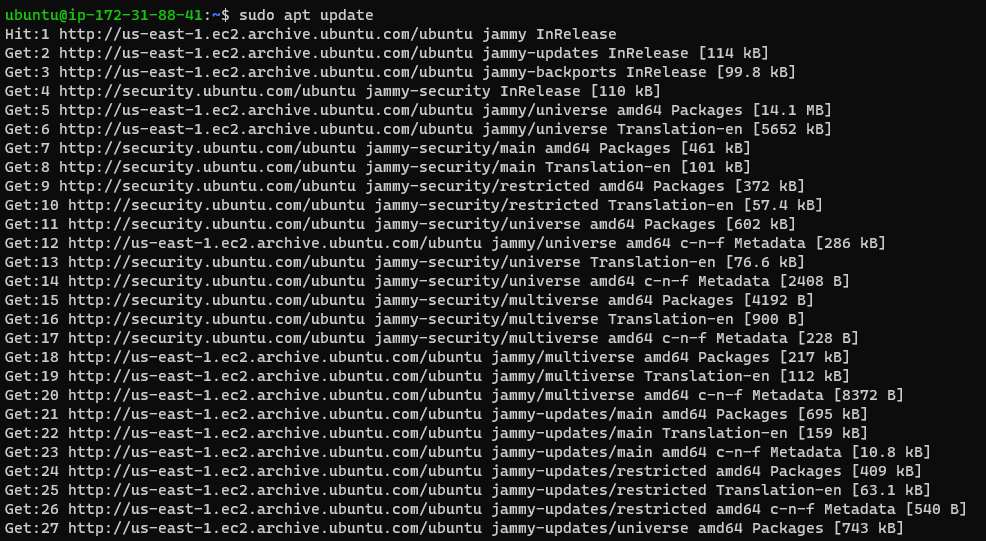
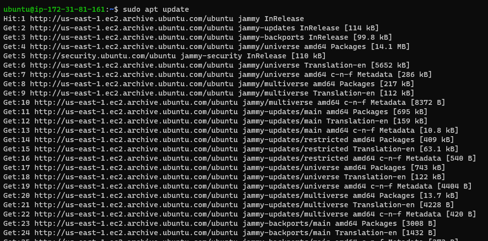
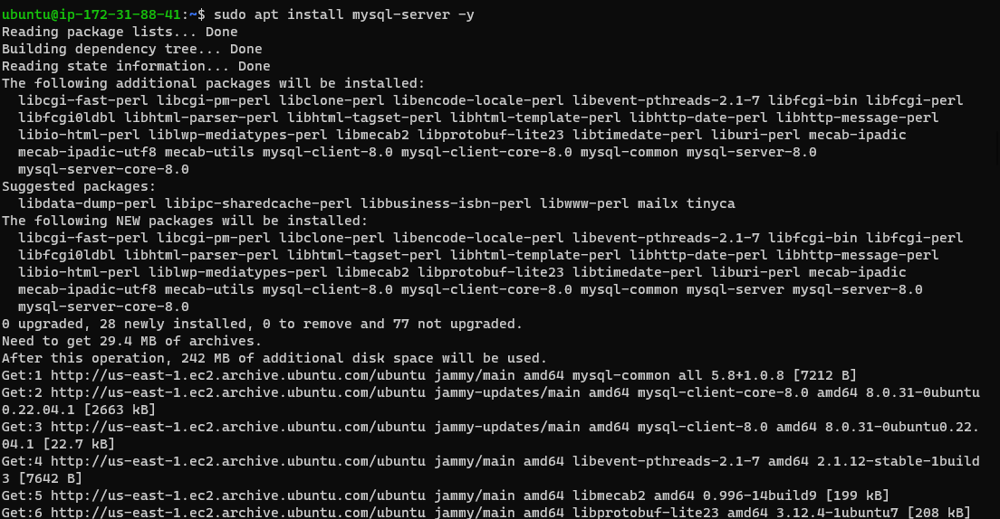
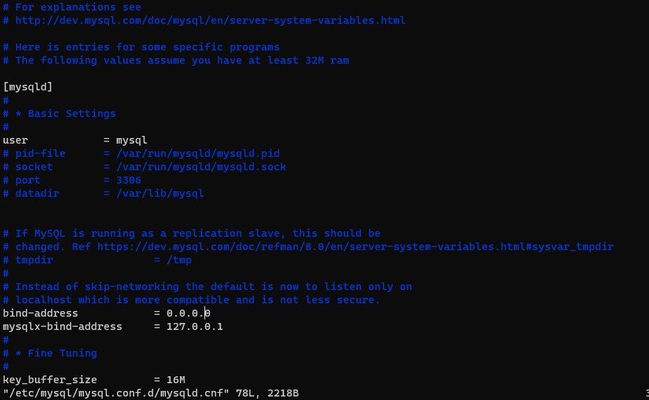
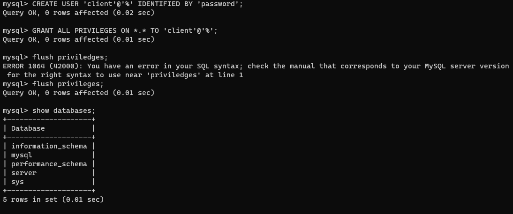
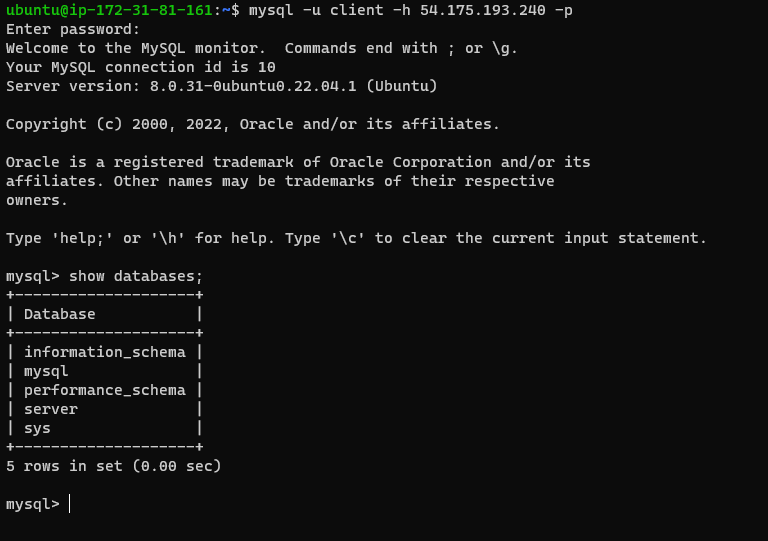

# IMPLEMENTING A CLIENT SERVER ARCHITECTURE USING MYSQL DBMS

## creating a server and client instance

### updating the server and client

`sudo apt update`

### installing mysql server 

`sudo apt install mysql-server -y`

*opened port 3306 on my server instance inbound rule*

### configure MySQL server to allow connections from remote hosts

`sudo vi /etc/mysql/mysql.conf.d/mysqld.cnf`

*change the bind-address to 0.0.0.0 to allow connection from remote hosts*

### creating mysql database for server

` CREATE USER 'database_name'@'IP_address' IDENTIFIED BY 'password';`

### Connecting to the server from client using the database credentials

`mysql -u database_name -h server_IP-address -p`

*-u is for username, -h is for host IP, -p is for password*

